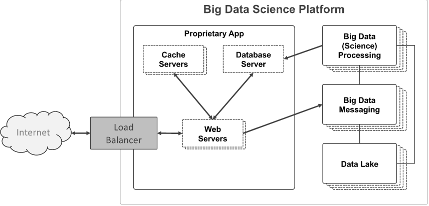

# Big_Data

# Beschreibung Big Data Use Case
Unser Big Data Use Case stellt über eine Flask Web Anwendung, verschiedene Information zu Kriminalität in Chicago dar. Die Flask Anwendung greift für die benötigten Daten auf eine MySQL Datenbank zu. Des Weiteren werden die Daten durch Memcached für eine bestimmte Zeit im Cache gespeichert, um so eine bessere Performance zu ermöglichen. 

# Architektur

